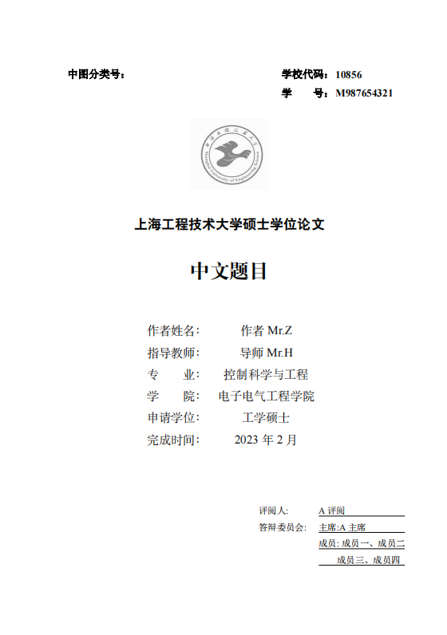
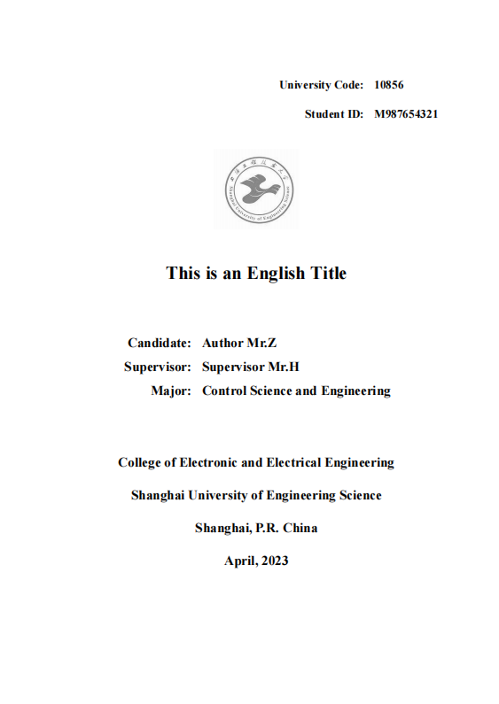

# 上海工程技术大学硕士学位论文latex模板
这是我根据学校研究生处给的docx硕士学位论文模板撰写的latex学位论文模板，欢迎大家使用。硕士学位论文模板当中包含有以下三个部分：
+ 开题报告模板
+ 学位论文模板
+ 答辩PPT模板

其中答辩PPT模板我分为三个阶段的模板，分别表示开题答辩、中期答辩和最终答辩，细微调整了一些模板，以供大家参考和使用。

如果在编译过程中遇到什么问题，可以在项目提交`issue`，`sues-thesis` 目前仅支持 `XeTeX`引擎，字符编码仅支持 UTF-8。
## 编译预览

<table>
  <tr>
    <td></td>
    <td></td>
  </tr>
</table>

## 使用方法

项目包含有三个文件夹，分别是开题报告（`report`）、答辩ppt（`ppt`、`beamer`）和论文模板（`paper`）。

### Linux/MacOS/FreeBSD/用户使用方法
推荐使用`Makefile`对latex模板进行编译，具体提供了以下几条可用的命令：
```bash
make all                # 编译生成paper.pdf
make clean              # 删除编译所产生的中间文件
make cleanall           # 删除paper.pdf 和所有中间文件
make wordcount          # 论文字数统计
```

### Windows用户使用方法
对于Windows用户，这里也提供了编译的脚本文件`Compile.bat`。可以直接双击编译也可以在命令行进行编译
```bat
.\Compile.bat all    :: 编译生成paper.pdf
.\Compile.bat clean    :: 删除编译所产生的中间文件
.\Compile.bat cleanall    :: 删除paper.pdf 和所有中间文件
.\Compile.bat wordcount    :: 论文字数统计
```
更多模板使用方法，详细参考

### 下载模板
普通用户可以直接`clone`或者下载`master.zip`.
```bash
git clone https://github.com/mobtgzhang/sues-thesis.git
```
### 可能出现的一些问题
Linux和MacOS可能会出现字体问题，解决的方法可以修改`cls`中`setCJKmainfont`字体，将`SimSun`修改为`STSongti-SC-Regular`字体。

Linux由于缺少Windows字体，可以使用下面的方法添加Windows字体到Linux系统当中。
```bash
sudo mkdir -p /usr/share/fonts/winfonts # 共享文件夹下创建Windows字体库
sudo cp Windows/Fonts/* /usr/share/fonts/winfonts/ # 将Windows字体复制到对应的文件夹下面，注意将标定的文件夹替换为Windows所在的目录
sudo mkfontdir
sudo mkfontscale
sudo fc-cache -fv
```

## overleaf 使用方法
点击下面链接访问即可
+ [报告模板sues-report](https://www.overleaf.com/read/dgcffrccywsx)；
+ [论文模板sues-thesis](https://www.overleaf.com/read/wsxxrhvmfhjm)；
+ [答辩sues-ppt](https://www.overleaf.com/read/wvnggtjdkjbc)。

overleaf 需要将源码导入到自己的项目当中，上述链接是只读模式，注意把编译设置为`xetex`编译选项，目前不支持`pdflatex`。

## latexstudio下载地址
+ [报告模板sues-report](https://www.latexstudio.net/index/details/index/ids/3058)
+ [论文模板sues-thesis](https://www.latexstudio.net/index/details/index/ids/3061)
## 免责声明

此模板为个人实现，未得到学校任何相关人员的认证，使用者应当自行承担一切后果。

## 参考

+ [GBT7714-2005标准下的BibTeX样式](https://github.com/Haixing-Hu/GBT7714-2005-BibTeX-Style)
+ [GBT7714-2015标准下的BibTex样式](https://github.com/zepinglee/gbt7714-bibtex-style)
+ [上海交通大学latex模板](https://github.com/sjtug/SJTUThesis)
+ 清华大学学位论文latex模板

